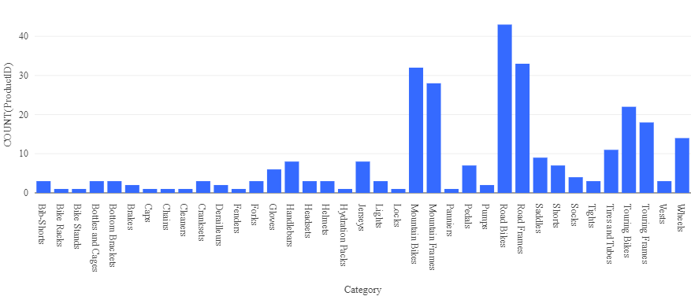

---
lab:
  title: Explorar Azure Databricks
---

# Explorar Azure Databricks

Azure Databricks es una versión basada en Microsoft Azure de la conocida plataforma de código abierto Databricks.

Un *área de trabajo* de Azure Databricks proporciona un punto central para administrar clústeres, datos y recursos de Databricks en Azure.

En este ejercicio, aprovisionarás un área de trabajo de Azure Databricks y explorarás algunas de sus funcionalidades principales. 

Este ejercicio debería tardar aproximadamente **20** minutos en completarse.

> **Nota**: la interfaz de usuario de Azure Databricks está sujeta a una mejora continua. Es posible que la interfaz de usuario haya cambiado desde que se escribieron las instrucciones de este ejercicio.

## Aprovisiona un área de trabajo de Azure Databricks.

> **Sugerencia**: si ya tienes un área de trabajo de Azure Databricks, puedes omitir este procedimiento y usar el área de trabajo existente.

1. Inicia sesión en **Azure Portal** en `https://portal.azure.com`.
2. Usa el botón **[\>_]** situado a la derecha de la barra de búsqueda en la parte superior de la página para crear una nueva instancia de Cloud Shell en Azure Portal, para lo que deberás seleccionar un entorno de ***PowerShell***. Cloud Shell proporciona una interfaz de línea de comandos en un panel situado en la parte inferior de Azure Portal, como se muestra a continuación:

    

    > **Nota**: si has creado anteriormente una instancia de Cloud Shell que usa un entorno de *Bash*, cámbiala a ***PowerShell***.

3. Ten en cuenta que puedes cambiar el tamaño de la instancia de Cloud Shell. Para ello, arrastra la barra de separación de la parte superior del panel o utiliza los iconos **&#8212;**, **&#10530;** y **X** de la parte superior derecha del panel para minimizar, maximizar y cerrar el panel. Para obtener más información sobre el uso de Azure Cloud Shell, consulta la [documentación de Azure Cloud Shell](https://docs.microsoft.com/azure/cloud-shell/overview).

4. En el panel de PowerShell, introduce los siguientes comandos para clonar este repositorio:

    ```
    rm -r mslearn-databricks -f
    git clone https://github.com/Netec-Mx/mslearn-databricks.git
    ```

5. Una vez clonado el repositorio, escribe el siguiente comando para ejecutar el script **setup.ps1**, que aprovisiona un área de trabajo de Azure Databricks en una región disponible:

    ```
    .mslearn-databricks/DP-3011/setup.ps1
    ```

6. Si se solicita, elige la suscripción que quieres usar (esto solo ocurrirá si tienes acceso a varias suscripciones de Azure).
7. Espera a que se complete el script: normalmente tarda unos 5 minutos, pero en algunos casos puede tardar más. Mientras esperas, revisa el artículo [Análisis de datos exploratorios en Azure Databricks](https://learn.microsoft.com/azure/databricks/exploratory-data-analysis/) en la documentación de Azure Databricks.

## Crear un clúster

Azure Databricks es una plataforma de procesamiento distribuido que usa clústeres* de Apache Spark *para procesar datos en paralelo en varios nodos. Cada clúster consta de un nodo de controlador para coordinar el trabajo y nodos de trabajo para hacer tareas de procesamiento. En este ejercicio, crearás un clúster de *nodo único* para minimizar los recursos de proceso usados en el entorno de laboratorio (en los que se pueden restringir los recursos). En un entorno de producción, normalmente crearías un clúster con varios nodos de trabajo.

> **Sugerencia**: si ya dispones de un clúster con una versión de runtime 13.3 LTS o superior en tu área de trabajo de Azure Databricks, puedes utilizarlo para completar este ejercicio y omitir este procedimiento.

1. En Azure Portal, navega al grupo de recursos **msl-*xxxxxxx*** que (o al grupo de recursos que contiene tu área de trabajo de Azure Databricks existente) y selecciona tu recurso de servicio de Azure Databricks.
1. En la página **Información general** del área de trabajo, usa el botón **Inicio del área de trabajo** para abrir el área de trabajo de Azure Databricks en una nueva pestaña del explorador; inicia sesión si se solicita.

    > **Sugerencia**: al usar el portal del área de trabajo de Databricks, se pueden mostrar varias sugerencias y notificaciones. Descarta estos elementos y sigue las instrucciones proporcionadas para completar las tareas de este ejercicio.

1. En la barra lateral de la izquierda, selecciona la tarea **(+) Nuevo** y luego selecciona **Clúster** (es posible que debas buscar en el submenú **Más**).
1. En la página **Nuevo clúster**, crea un clúster con la siguiente configuración:
    - **Nombre del clúster**: clúster del *Nombre de usuario*  (el nombre del clúster predeterminado)
    - **Directiva**: Unrestricted (Sin restricciones)
    - **Modo de clúster** de un solo nodo
    - **Modo de acceso**: usuario único (*con la cuenta de usuario seleccionada*)
    - **Versión de runtime de Databricks**: 13.3 LTS (Spark 3.4.1, Scala 2.12) o posterior
    - **Usar aceleración de Photon**: seleccionado
    - **Tipo de nodo**: Standard_D4ds_v4
    - **Finaliza después de** *20* **minutos de inactividad**

1. Espera a que se cree el clúster. Esto puede tardar un par de minutos.

> **Nota**: si el clúster no se inicia, es posible que la suscripción no tenga cuota suficiente en la región donde se aprovisiona el área de trabajo de Azure Databricks. Para obtener más información, consulta [El límite de núcleos de la CPU impide la creación de clústeres](https://docs.microsoft.com/azure/databricks/kb/clusters/azure-core-limit). Si esto sucede, puedes intentar eliminar el área de trabajo y crear una nueva en otra región.

## Uso de Spark para analizar datos

Como en muchos entornos de Spark, Databricks admite el uso de cuadernos para combinar notas y celdas de código interactivas que puedes usar para explorar datos.

1. Descargue el archivo [**products.csv**](https://raw.githubusercontent.com/MicrosoftLearning/mslearn-databricks/main/data/products.csv) de `https://raw.githubusercontent.com/MicrosoftLearning/mslearn-databricks/main/data/products.csv` en el equipo local y guárdelo como **products.csv**.
1. En la barra lateral, en el menú del vínculo **(+) Nuevo**, selecciona **Agregar o cargar datos**.
1. Selecciona **Crear o modificar tabla** y carga el archivo **products.csv** que descargaste en el equipo.
1. En la página **Crear o modificar tabla a partir de la carga de archivos**, asegúrese de que el clúster esté seleccionado en la parte superior derecha de la página. A continuación, elija el catálogo de **hive_metastore** y su esquema predeterminado para crear una nueva tabla denominada **productos**.
1. En la página **Explorador de catálogos**, cuando se haya creado la tabla **productos**, en el menú del botón **Crear**, selecciona **Cuadernos** para crear un cuaderno.
1. En el cuaderno, asegúrese de que el cuaderno esté conectado al clúster y, a continuación, revise el código que se agregó automáticamente a la primera celda, el cual debería tener un aspecto similar al siguiente:

    ```python
    %sql
    SELECT * FROM `hive_metastore`.`default`.`products`;
    ```

1. Use la opción de menú **&#9656; Ejecutar celda** situada a la izquierda de la celda para ejecutarla, iniciando y adjuntando el clúster si se le solicitase.
1. Espera a que el código ejecute el trabajo de Spark. El código recupera datos de la tabla que se creó en función del archivo que cargó.
1. Encima de la tabla de resultados, selecciona **+** y luego **Visualización** para ver el editor de visualización y luego aplica las siguientes opciones:
    - **Tipo de visualización**: barra
    - **Columna X**: categoría
    - **Columna Y**: *agrega una nueva columna y selecciona ***ProductID**. *Aplica la **agregación* de la **cuenta**.

    Guarda la visualización y observa que aparece en el cuaderno, del siguiente modo:

    

## Análisis de datos con un dataframe

Aunque la mayoría de los analistas de datos se sienten cómodos usando código SQL como en el ejemplo anterior, algunos analistas y científicos de datos pueden usar objetos nativos de Spark como un *dataframe* en lenguajes de programación como *PySpark* (una versión de Python optimizada para Spark) para trabajar de forma eficaz con datos.

1. En el cuaderno, en la salida del gráfico de la celda de código ejecutada anteriormente, usa el icono **+ Código** para agregar una nueva celda.

    > **Sugerencia**: es posible que tengas que mover el mouse debajo de la celda de salida para que aparezca el icono **+ Código**.

1. Escribe y ejecuta el siguiente código en la nueva celda:

    ```python
    df = spark.sql("SELECT * FROM products")
    df = df.filter("Category == 'Road Bikes'")
    display(df)
    ```

1. Ejecute la nueva celda, que devolverá los productos de la categoría *Bicicletas de carretera*.

## Limpiar

En el portal de Azure Databricks, en la página **Proceso**, selecciona el clúster y **&#9632; Finalizar** para apagarlo.

Si has terminado de explorar Azure Databricks, puedes eliminar los recursos que has creado para evitar costes innecesarios de Azure y liberar capacidad en tu suscripción.
