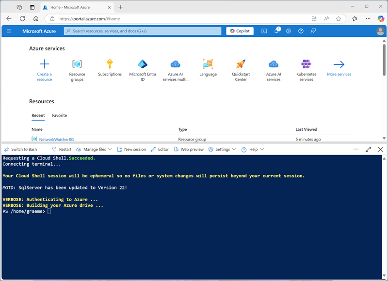

---
lab:
  title: Uso de Delta Lake en Azure Databricks
---

# Uso de Delta Lake en Azure Databricks

Delta Lake es un proyecto de código abierto para crear una capa de almacenamiento de datos transaccional para Spark sobre un lago de datos. Delta Lake agrega compatibilidad con la semántica relacional para las operaciones de datos por lotes y de streaming, y permite la creación de una arquitectura de *almacenamiento de lago* en la que se puede usar Apache Spark para procesar y consultar datos en tablas basadas en archivos subyacentes en el lago de datos.

Este laboratorio se tarda aproximadamente **30** minutos en completarse.

> **Nota**: la interfaz de usuario de Azure Databricks está sujeta a una mejora continua. Es posible que la interfaz de usuario haya cambiado desde que se escribieron las instrucciones de este ejercicio.

## Aprovisiona un área de trabajo de Azure Databricks.

> **Sugerencia**: si ya tienes un área de trabajo de Azure Databricks, puedes omitir este procedimiento y usar el área de trabajo existente.

En este ejercicio, se incluye un script para aprovisionar una nueva área de trabajo de Azure Databricks. El script intenta crear un recurso de área de trabajo de Azure Databricks de nivel *Premium* en una región en la que la suscripción de Azure tiene cuota suficiente para los núcleos de proceso necesarios en este ejercicio, y da por hecho que la cuenta de usuario tiene permisos suficientes en la suscripción para crear un recurso de área de trabajo de Azure Databricks. Si se produjese un error en el script debido a cuota o permisos insuficientes, intenta [crear un área de trabajo de Azure Databricks de forma interactiva en Azure Portal](https://learn.microsoft.com/azure/databricks/getting-started/#--create-an-azure-databricks-workspace).

1. En un explorador web, inicia sesión en [Azure Portal](https://portal.azure.com) en `https://portal.azure.com`.
2. Usa el botón **[\>_]** situado a la derecha de la barra de búsqueda en la parte superior de la página para crear una nueva instancia de Cloud Shell en Azure Portal, para lo que deberás seleccionar un entorno de ***PowerShell***. Cloud Shell proporciona una interfaz de línea de comandos en un panel situado en la parte inferior de Azure Portal, como se muestra a continuación:

    

    > **Nota**: si has creado anteriormente una instancia de Cloud Shell que usa un entorno de *Bash*, cámbiala a ***PowerShell***.

3. Ten en cuenta que puedes cambiar el tamaño de la instancia de Cloud Shell. Para ello, arrastra la barra de separación de la parte superior del panel o utiliza los iconos **&#8212;**, **&#10530;** y **X** de la parte superior derecha del panel para minimizar, maximizar y cerrar el panel. Para obtener más información sobre el uso de Azure Cloud Shell, consulta la [documentación de Azure Cloud Shell](https://docs.microsoft.com/azure/cloud-shell/overview).

4. En el panel de PowerShell, introduce los siguientes comandos para clonar este repositorio:

    ```powershell
    rm -r mslearn-databricks -f
        git clone https://github.com/Netec-Mx/mslearn-databricks.git
    ```

5. Una vez clonado el repositorio, escribe el siguiente comando para ejecutar el script **setup.ps1**, que aprovisiona un área de trabajo de Azure Databricks en una región disponible:

    ```powershell
    ./mslearn-databricks/DP-3011/setup.ps1
    ```

6. Si se solicita, elige la suscripción que quieres usar (esto solo ocurrirá si tienes acceso a varias suscripciones de Azure).

7. Espera a que se complete el script: normalmente puede tardar entre 5 y 10 minutos, pero en algunos casos puede tardar más. Mientras esperas, revisa el artículo [Introducción a Delta Lake](https://docs.microsoft.com/azure/databricks/delta/delta-intro) en la documentación de Azure Databricks.

## Crear un clúster

Azure Databricks es una plataforma de procesamiento distribuido que usa clústeres* de Apache Spark *para procesar datos en paralelo en varios nodos. Cada clúster consta de un nodo de controlador para coordinar el trabajo y nodos de trabajo para hacer tareas de procesamiento. En este ejercicio, crearás un clúster de *nodo único* para minimizar los recursos de proceso usados en el entorno de laboratorio (en los que se pueden restringir los recursos). En un entorno de producción, normalmente crearías un clúster con varios nodos de trabajo.

> **Sugerencia**: si ya dispones de un clúster con una versión de runtime 13.3 LTS o superior en tu área de trabajo de Azure Databricks, puedes utilizarlo para completar este ejercicio y omitir este procedimiento.

1. En Azure Portal, ve al grupo de recursos **msl-*xxxxxxx*** que se creó con el script (o al grupo de recursos que contiene el área de trabajo de Azure Databricks existente)

1. Selecciona el recurso Azure Databricks Service (llamado **databricks-*xxxxxxx*** si usaste el script de instalación para crearlo).

1. En la página **Información general** del área de trabajo, usa el botón **Inicio del área de trabajo** para abrir el área de trabajo de Azure Databricks en una nueva pestaña del explorador; inicia sesión si se solicita.

    > **Sugerencia**: al usar el portal del área de trabajo de Databricks, se pueden mostrar varias sugerencias y notificaciones. Descarta estos elementos y sigue las instrucciones proporcionadas para completar las tareas de este ejercicio.

1. En la barra lateral de la izquierda, selecciona la tarea **(+) Nuevo** y luego selecciona **Clúster** (es posible que debas buscar en el submenú **Más**).

1. En la página **Nuevo clúster**, crea un clúster con la siguiente configuración:
    - **Nombre del clúster**: clúster del *Nombre de usuario*  (el nombre del clúster predeterminado)
    - **Directiva**: Unrestricted (Sin restricciones)
    - **Modo de clúster** de un solo nodo
    - **Modo de acceso**: usuario único (*con la cuenta de usuario seleccionada*)
    - **Versión de runtime de Databricks**: 13.3 LTS (Spark 3.4.1, Scala 2.12) o posterior
    - **Usar aceleración de Photon**: seleccionado
    - **Tipo de nodo**: Standard_D4ds_v4
    - **Finaliza después de** *20* **minutos de inactividad**

1. Espera a que se cree el clúster. Esto puede tardar un par de minutos.

    > **Nota**: si el clúster no se inicia, es posible que la suscripción no tenga cuota suficiente en la región donde se aprovisiona el área de trabajo de Azure Databricks. Para obtener más información, consulta [El límite de núcleos de la CPU impide la creación de clústeres](https://docs.microsoft.com/azure/databricks/kb/clusters/azure-core-limit). Si esto sucede, puedes intentar eliminar el área de trabajo y crear una nueva en otra región. Puedes especificar una región como parámetro para el script de configuración de la siguiente manera: `./mslearn-databricks/setup.ps1 eastus`

## Creación de un cuaderno e ingesta de datos

Ahora vamos a crear un cuaderno de Spark e importar los datos con los que trabajaremos en este ejercicio.

1. En la barra lateral, usa el vínculo **(+) Nuevo** para crear un **cuaderno**.

1. Cambia el nombre por defecto del cuaderno (**Cuaderno sin título *[fecha]***) por `Explore Delta Lake` y en la lista desplegable **Conectar**, selecciona tu clúster si aún no está seleccionado. Si el clúster no se está ejecutando, puede tardar un minuto en iniciarse.

1. En la primera celda del cuaderno, escribe el siguiente código, que utiliza comandos del *shell* para descargar los archivos de datos de GitHub en el sistema de archivos utilizado por el clúster.

    ```python
    %sh
    rm -r /dbfs/delta_lab
    mkdir /dbfs/delta_lab
    wget -O /dbfs/delta_lab/products.csv https://raw.githubusercontent.com/MicrosoftLearning/mslearn-databricks/main/data/products.csv
    ```

1. Usa la opción del menú **&#9656; Ejecutar celda** situado a la izquierda de la celda para ejecutarla. A continuación, espera a que se complete el trabajo de Spark ejecutado por el código.

1. Debajo de la celda de código existente, usa el icono **+ Código** para agregar una nueva celda de código. A continuación, en la nueva celda, escriba y ejecute el siguiente código para cargar los datos del archivo y ver las primeras 10 filas.

    ```python
   df = spark.read.load('/delta_lab/products.csv', format='csv', header=True)
   display(df.limit(10))
    ```

## Cargar los datos del archivo en una tabla Delta

Los datos se han cargado en una trama de datos. Vamos a conservarlo en una tabla delta.

1. Agregue una nueva celda de código y úsela para ejecutar el siguiente código:

    ```python
   delta_table_path = "/delta/products-delta"
   df.write.format("delta").save(delta_table_path)
    ```

    Los datos de una tabla de Delta Lake se almacenan en formato Parquet. También se crea un archivo de registro para realizar un seguimiento de las modificaciones realizadas en los datos.

1. Agrega una nueva celda de código y úsala para ejecutar el siguiente comando de shell para ver el contenido de la carpeta en la que se han guardado los datos diferenciales.

    ```
    %sh
    ls /dbfs/delta/products-delta
    ```

1. Los datos de archivo en formato Delta se pueden cargar en un objeto **DeltaTable**, que puede usar para ver y actualizar los datos de la tabla. Ejecute el siguiente código en una nueva celda para actualizar los datos; reduciendo el precio del producto 771 en un 10 %.

    ```python
   from delta.tables import *
   from pyspark.sql.functions import *
   
   # Create a deltaTable object
   deltaTable = DeltaTable.forPath(spark, delta_table_path)
   # Update the table (reduce price of product 771 by 10%)
   deltaTable.update(
       condition = "ProductID == 771",
       set = { "ListPrice": "ListPrice * 0.9" })
   # View the updated data as a dataframe
   deltaTable.toDF().show(10)
    ```

    La actualización se conserva en los datos de la carpeta delta y se reflejará en cualquier nuevo marco de datos cargado desde esa ubicación.

1. Ejecute el siguiente código para crear un nuevo marco de datos a partir de los datos de la tabla delta:

    ```python
   new_df = spark.read.format("delta").load(delta_table_path)
   new_df.show(10)
    ```

## Exploración del registro y *viaje en el tiempo*

Las modificaciones de datos se registran, lo que le permite usar las funcionalidades de *viaje en el tiempo* de Delta Lake para ver las versiones anteriores de los datos. 

1. En una nueva celda de código, use el siguiente código para ver la versión original de los datos del producto:

    ```python
   new_df = spark.read.format("delta").option("versionAsOf", 0).load(delta_table_path)
   new_df.show(10)
    ```

1. El registro contiene un historial completo de modificaciones en los datos. Use el siguiente código para ver un registro de los últimos 10 cambios:

    ```python
   deltaTable.history(10).show(10, False, True)
    ```

## Creación de tablas de catálogo

Hasta ahora has trabajado con tablas Delta cargando datos de la carpeta que contiene los archivos Parquet en los que se basa la tabla. Puedes definir *tablas de catálogo* que encapsulan los datos y proporcionar una entidad de tabla denominada a la que puedes hacer referencia en código SQL. Spark admite dos tipos de tablas de catálogo para Delta Lake:

- Tablas *externas* definidas por la ruta de acceso a los archivos que contienen los datos de la tabla.
- Tablas *administradas* que se definen en el metastore.

### Crear una tabla externa

1. Usa el siguiente código para crear una nueva base de datos denominada **AdventureWorks** y después crea una tabla externa denominada **ProductosExternos** en esa base de datos en función de la ruta de acceso a los archivos Delta que has definido anteriormente:

    ```python
   spark.sql("CREATE DATABASE AdventureWorks")
   spark.sql("CREATE TABLE AdventureWorks.ProductsExternal USING DELTA LOCATION '{0}'".format(delta_table_path))
   spark.sql("DESCRIBE EXTENDED AdventureWorks.ProductsExternal").show(truncate=False)
    ```

    Tenga en cuenta que la propiedad **Ubicación** de la nueva tabla es la ruta de acceso especificada.

1. Use el siguiente código para consultar la tabla:

    ```sql
   %sql
   USE AdventureWorks;
   SELECT * FROM ProductsExternal;
    ```

### Creación de una tabla administrada

1. Ejecuta el siguiente código para crear (y luego describir) una tabla administrada denominada **ProductsManaged** en función del marco de datos que has cargado originalmente desde el archivo **products.csv** (antes de actualizar el precio del producto 771).

    ```python
   df.write.format("delta").saveAsTable("AdventureWorks.ProductsManaged")
   spark.sql("DESCRIBE EXTENDED AdventureWorks.ProductsManaged").show(truncate=False)
    ```

    No ha especificado una ruta de acceso para los archivos parquet usados por la tabla; esto se administra en el metastore de Hive y se muestra en la propiedad **Ubicación** en la descripción de la tabla.

1. Use el siguiente código para consultar la tabla administrada, teniendo en cuenta que la sintaxis es la misma que para una tabla administrada:

    ```sql
   %sql
   USE AdventureWorks;
   SELECT * FROM ProductsManaged;
    ```

### Comparar las tablas externas y administradas

1. Use el siguiente código para enumerar las tablas de la base de datos **AdventureWorks**:

    ```sql
   %sql
   USE AdventureWorks;
   SHOW TABLES;
    ```

1. Ahora use el siguiente código para ver las carpetas en las que se basan estas tablas:

    ```Bash
    %sh
    echo "External table:"
    ls /dbfs/delta/products-delta
    echo
    echo "Managed table:"
    ls /dbfs/user/hive/warehouse/adventureworks.db/productsmanaged
    ```

1. Use el siguiente código para eliminar ambas tablas de la base de datos:

    ```sql
   %sql
   USE AdventureWorks;
   DROP TABLE IF EXISTS ProductsExternal;
   DROP TABLE IF EXISTS ProductsManaged;
   SHOW TABLES;
    ```

1. Ahora vuelva a ejecutar la celda que contiene el siguiente código para ver el contenido de las carpetas delta:

    ```Bash
    %sh
    echo "External table:"
    ls /dbfs/delta/products-delta
    echo
    echo "Managed table:"
    ls /dbfs/user/hive/warehouse/adventureworks.db/productsmanaged
    ```

    Los archivos de la tabla administrada se eliminan automáticamente cuando se quita la tabla. Sin embargo, los archivos de la tabla externa permanecen. La eliminación de una tabla externa solo quita los metadatos de la tabla de la base de datos; no elimina los archivos de datos.

1. Use el siguiente código para crear una nueva tabla en la base de datos basada en los archivos delta de la carpeta **products-delta**:

    ```sql
   %sql
   USE AdventureWorks;
   CREATE TABLE Products
   USING DELTA
   LOCATION '/delta/products-delta';
    ```

1. Use el siguiente código para consultar la nueva tabla:

    ```sql
   %sql
   USE AdventureWorks;
   SELECT * FROM Products;
    ```

    Dado que la tabla se basa en los archivos delta existentes, que incluyen el historial de cambios registrado, refleja las modificaciones realizadas anteriormente en los datos de los productos.

## Optimización del diseño de tabla

El almacenamiento físico de datos de tabla y los datos de índice asociados se pueden reorganizar para reducir el espacio de almacenamiento y mejorar la eficacia de E/S al acceder a la tabla. Esto resulta especialmente útil después de operaciones sustanciales de inserción, actualización o eliminación en una tabla.

1. En una nueva celda de código, usa el código siguiente para optimizar el diseño y limpiar versiones anteriores de archivos de datos en la tabla delta:

     ```python
    spark.sql("OPTIMIZE Products")
    spark.conf.set("spark.databricks.delta.retentionDurationCheck.enabled", "false")
    spark.sql("VACUUM Products RETAIN 24 HOURS")
     ```

Delta Lake tiene una comprobación de seguridad para evitar que se ejecute un comando peligroso. En Databricks Runtime, si estás seguro de que en esta tabla no se realiza ninguna operación que tarde más tiempo que el intervalo de retención que planeas especificar, puedes desactivar esta comprobación de seguridad estableciendo la propiedad de configuración de Spark `spark.databricks.delta.retentionDurationCheck.enabled` en `false`.

> **Nota:** si ejecutas VACUUM en una tabla de Delta, pierdes la capacidad de regresar a una versión anterior al período de retención de datos especificado.

## Limpieza

En el portal de Azure Databricks, en la página **Proceso**, selecciona el clúster y **&#9632; Finalizar** para apagarlo.

Si has terminado de explorar Azure Databricks, puedes eliminar los recursos que has creado para evitar costes innecesarios de Azure y liberar capacidad en tu suscripción.
